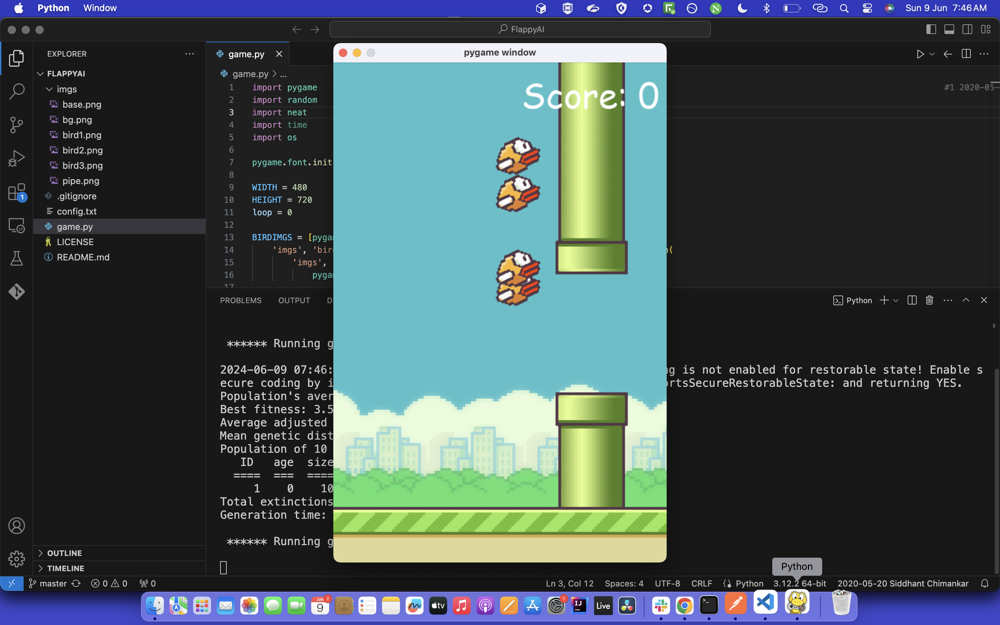
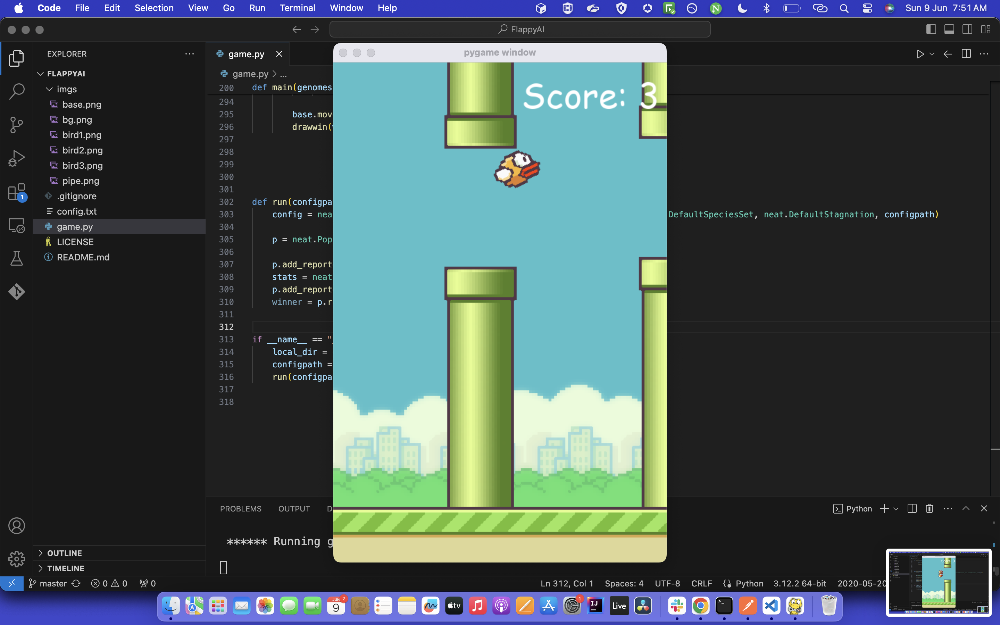

# Flappy Bird AI using NEAT

This project aims to develop an Artificial Intelligence (AI) system capable of playing the popular game Flappy Bird using the NeuroEvolution of Augmenting Topologies (NEAT) algorithm. NEAT is a powerful technique that evolves artificial neural networks through genetic algorithms, enabling the AI to learn and adapt to the game's challenging mechanics.

## Features

- **Genetic Algorithm**: The NEAT algorithm is employed to evolve neural networks that control the bird's movements, allowing the AI to learn and improve its performance over generations.
- **Pygame Integration**: The game is implemented using the Pygame library, providing a visually appealing and interactive environment for the AI to operate in.
- **Real-time Visualization**: Watch the AI in action as it navigates through the game, showcasing the evolution of its decision-making capabilities.
- **Configurable Parameters**: Easily adjust various parameters, such as population size, mutation rates, and fitness functions, to explore different evolutionary strategies.

## Getting Started

To run the Flappy Bird AI on your local machine, follow these steps:

git clone https://github.com/siddhantchimankar/flappy-bird-ai.git
pip install pygame neat-python
python game.py

## Configuration

The NEAT algorithm and game parameters can be configured by modifying the config.txt file. This file contains various settings, such as population size, mutation rates, and fitness functions. Refer to the NEAT documentation for more information on configuring the algorithm.

## Contributing

Contributions to this project are welcome! If you encounter any issues or have suggestions for improvements, please open an issue or submit a pull request. Make sure to follow the project's code of conduct.

## License

This project is licensed under the MIT License.

## Acknowledgements

This project was inspired by the work of TechWithTim and the NEAT algorithm developed by Kenneth O. Stanley and Risto Miikkulainen.

